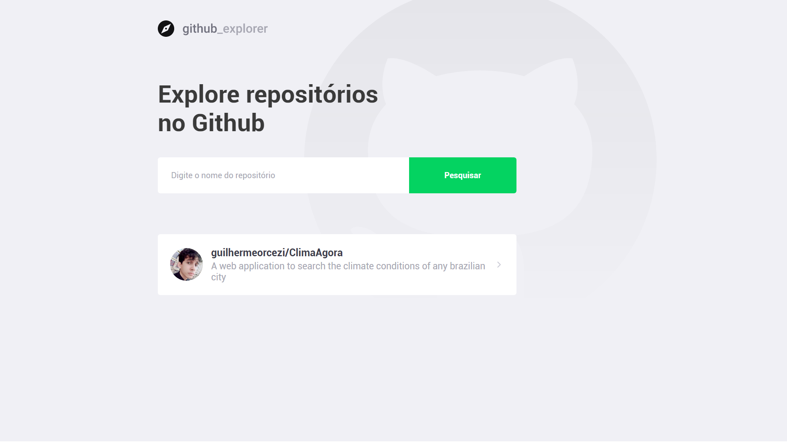

<h3 align="center">
    
    <br>
</h3>
<p align="initial"> 🚀 <strong> Github Explorer:</strong> Application to search Github repositories from the public Github API, listing their issues and showing the number of stars and forks.
 </p>
 
# :pushpin: Table of Contents

- [Technologies](#tecnologias-utilizadas)
- [How to run](#como-usar)

## :rocket: Technologies

The project was developed using the following technologies

- [React](https://pt-br.reactjs.org/)
## :fire: How to run

### :exclamation: React Application
To start the aplication clone this repository and use the commands:
```bash
yarn install // npm install
yarn start // npm start
```
---

<h4 align="center">
    Made with 💜 by <a href="https://www.linkedin.com/in/guilherme-orcezi" target="_blank">Guilherme Orcezi</a>
</h4>
